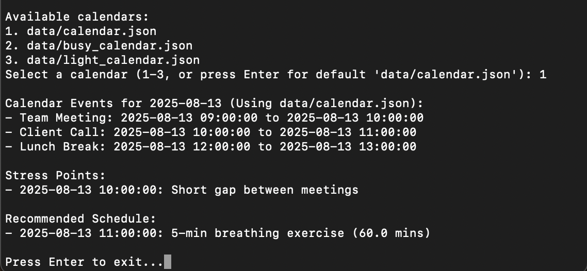
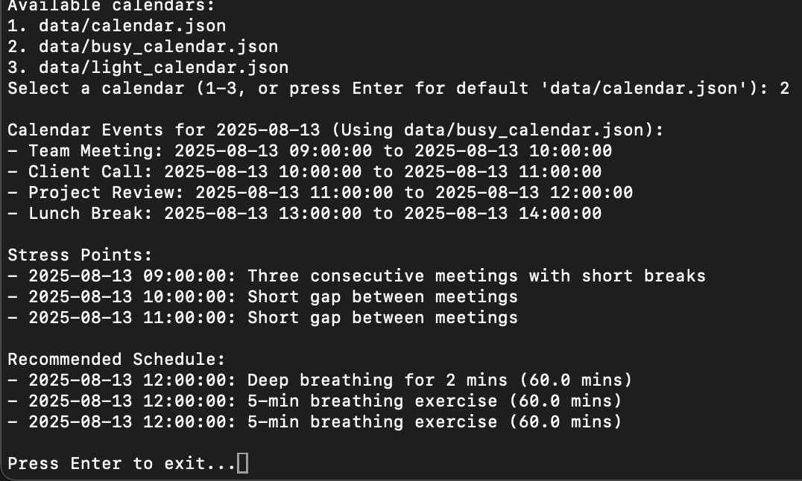
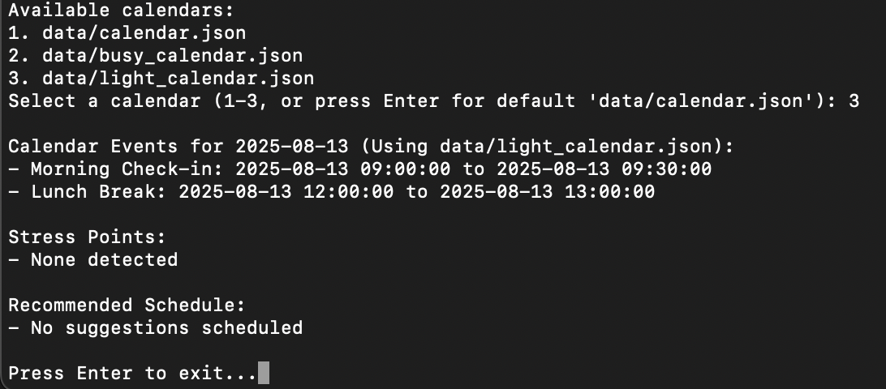

# MindSync – Personal Wellbeing Companion

MindSync predicts high-stress periods from your calendar and recommends short wellbeing activities (breathing, stretch, walk) at optimal times.

##  Features
- Parse calendar events from JSON (demo mode)
- Rule-based stress detection (meeting density, short gaps, context switches)
- Context-aware suggestions
- Simple CLI output (and optional HTML template)

## Project Structure
├─ src/
│ ├─ main.py
│ ├─ calendar_parser.py
│ ├─ stress_predictor.py
│ ├─ suggestions.py
│ └─ timing.py
├─ data/
│ ├─ calendar.json
│ ├─ busy_calendar.json
│ └─ light_calendar.json
├─ templates/
│ └─ index.html
└─ requirments.txt # typo kept to match project file

## Quick Start
> Tested on macOS with Python 3.10+.

```bash
# 1) Clone
git clone https://github.com/mayararab/MindSync.git
cd MindSync

# 2) (Optional but recommended) virtual env
python3 -m venv .venv
source .venv/bin/activate    # Windows: .venv\Scripts\activate

# 3) Install deps
python -m pip install -r requirments.txt

# 4) Run
python src/main.py

When prompted, choose:
1) data/calendar.json
2) data/busy_calendar.json
3) data/light_calendar.json


---

## Example Outputs
**Busy calendar** flagged:
- Three consecutive meetings with short breaks  
- Short gaps between meetings  

**Recommended**: Deep breathing and 5-min exercises inserted around the 12:00 gap.

*(Tip: you can add your screenshot of the terminal output here to impress examiners!)*

---

##  How It Works
- `calendar_parser.py`: loads and normalizes events  
- `stress_predictor.py`: rules for density, short breaks, context switches → stress points  
- `timing.py`: finds free slots ≥15 min  
- `suggestions.py`: maps slot length → activity  
- `main.py`: ties it all together; prints results (and can render HTML)

---

## Demo Video
Link: **<add your unlisted YouTube link here>**

## Report
Link: **<add your uploaded PDF/Doc link here>**  
(Or mention it’s submitted via your VLE.)

---

## Troubleshooting
- `ModuleNotFoundError`: ensure you activated the venv and installed requirements.  
- `No such file 'requirments.txt'`: ensure spelling matches.  
- Nothing happens: confirm you’re in the project root.

---

##  What NOT to commit
.venv/
pycache/
*.pyc
.DS_Store

---

## Reflection  
Working on this project helped me understand how simple rule-based logic in Python can be used to analyze real-world data like calendar events. I also learned how to organize code into multiple files and run it step by step, which improved my confidence with Python projects.

---
## Example Output

### Default Calendar
 

### Busy Calendar


### Light Calendar



